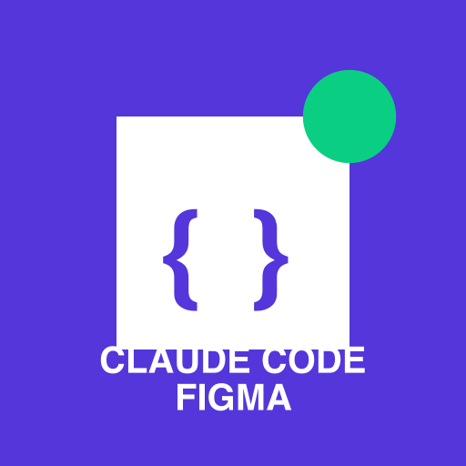

# claude-code-figma: An AI-First Developer Tool

<div align="center">
  
</div>

**Part of the Claude Code ecosystem of AI-integrated tools**

`claude-code-figma` is a command-line tool built from the ground up for AI integration. Unlike traditional developer tools meant for direct use, this CLI is optimized for Claude Code to extract, transform, and implement Figma designs as code that seamlessly integrates with your existing project.

> 🤖 **AI-First Approach**: Commands, outputs, and workflows are designed for optimal Claude Code interpretation, creating a bridge between Figma designs and your codebase.

## Installation

### Global Installation

```bash
npm install -g claude-code-figma
```

### Local Installation

```bash
npm install claude-code-figma
```

## Usage

### Authentication

Before using the tool, you need to authenticate with Figma:

```bash
claude-code-figma auth
```

This will guide you through creating a personal access token on Figma's website and saving it securely.

### Extract Metadata

To extract metadata from a Figma component:

```bash
claude-code-figma extract [figma-url]
```

Example:

```bash
claude-code-figma extract https://www.figma.com/file/abcdef123456/MyDesigns?node-id=123%3A456
```

### Options

- `-o, --output <path>`: Save output to a file instead of printing to console
- `-f, --format <format>`: Output format (ai-prompt, json, yaml, summary). Default: ai-prompt
- `-v, --verbose`: Enable verbose logging

Example:

```bash
# Using default AI prompt format (recommended)
claude-code-figma extract https://www.figma.com/file/abcdef123456/MyDesigns?node-id=123%3A456

# Save to file
claude-code-figma extract https://www.figma.com/file/abcdef123456/MyDesigns?node-id=123%3A456 --output component-prompt.txt

# Using other formats
claude-code-figma extract https://www.figma.com/file/abcdef123456/MyDesigns?node-id=123%3A456 --format json
```

## Output Formats

### AI Prompt Format (Default)

The default `ai-prompt` format creates a detailed, hierarchical description of the design that is optimized for AI consumption:

```
Your task is to create a React component that matches the following Figma design:

Design Element:
- Type: FRAME
- Name: Button
- Width: 120px
- Height: 40px
- Background Color: #0066ff
- Border Radius: 4
- Contains:
  Design Element:
  - Type: TEXT
  - Name: Button Text
  - Text: "Click Me"
  - Font Family: Inter
  - Font Size: 16px
  - Font Weight: 500
  - Text Alignment: center
  - Color: #ffffff

The component should be written in React with Tailwind CSS.
Assume that the host project uses React and Tailwind CSS, and you can reuse any existing components or styles from the project's scope.
Generate the complete React component code.
```

This structured format helps Claude Code:
1. Understand the component hierarchy
2. Capture all styling details with precise measurements
3. Implement text content with proper typography
4. Create accurate layout with proper spacing
5. Generate Tailwind CSS classes that match the design

### Other Formats

- `json`: Raw extracted design data in JSON format
- `yaml`: YAML representation of the design data
- `summary`: Legacy format with component blueprint and embedded information

## Integration with Claude Code

### Using the Init Command with Claude Code (Easiest)

The easiest way to set up integration is to:

1. Install this tool in your project:
   ```bash
   npm install --save-dev claude-code-figma
   ```

2. Ask Claude Code to run the init command:
   ```
   Please run claude-code-figma init and follow its instructions to create a CLAUDE.md file
   ```

3. Claude Code will:
   - Run the `init` command
   - Read the instructions
   - Create a customized CLAUDE.md file for your project
   - Adjust it based on your project's structure

### Manual Integration

Alternatively, you can manually add the following to your project's `CLAUDE.md` file:

```markdown
## Figma Integration

This project uses the `claude-code-figma` CLI tool to extract design information from Figma. 

### Converting Figma designs to code

When a Figma link is provided, use the following steps:

1. Extract the Figma metadata using the AI-optimized prompt format:
   ```bash
   claude-code-figma extract <figma-url>
   ```

2. The output is a structured prompt that contains:
   - Detailed component hierarchy with all design elements
   - Complete styling information with measurements
   - Text content and typography details
   - Layout properties (flex direction, gaps, alignment)
   - Border, radius, and effect information

3. Based on the extracted information, implement the component using:
   - The project's existing theme system for colors, typography, and spacing
   - React components with Tailwind CSS for styling
   - The component structure from the Figma design
   - The naming conventions used in the codebase
```

## Example Workflow

1. User provides a Figma link to Claude
2. Claude runs `claude-code-figma extract <url>` to get the AI-optimized design description
3. Claude analyzes the design data and the project's existing codebase
4. Claude generates a React component with Tailwind CSS that matches the design while respecting project conventions
5. If needed, Claude suggests custom color additions to the Tailwind config

## The AI-First CLI Paradigm

`claude-code-figma` represents a new approach to developer tooling, where:

1. **Designed for AI Collaboration**: Commands are structured for optimal AI interpretation, not just human readability
2. **Contextually Adaptive**: Outputs adapt to each project's specific conventions and structure
3. **Progressive Discovery**: The tool helps Claude Code understand your project's patterns and preferences over time
4. **Metadata Transformation**: Figma design data is transformed to match your code's structure and style
5. **Natural Language Interface**: Users interact with the tool through Claude Code using natural language

This approach shifts the developer workflow from:

```
Human → CLI → Output → Human interpretation → Code
```

To a more efficient model:

```
Human → Claude Code → CLI → Optimized data → Claude Code → Production-ready code
```

By embracing this AI-first paradigm, `claude-code-figma` dramatically reduces the cognitive load and manual effort required to implement designs, allowing developers to focus on higher-level tasks while maintaining full control over the code quality and style.

## License

ISC